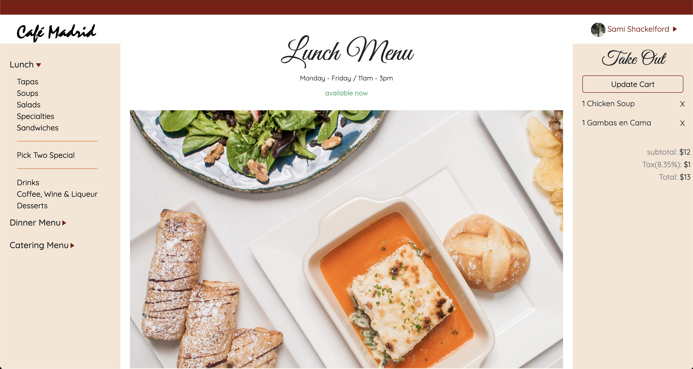

### Online Ordering App
Full-Stack web application built to recreate a customized online ordering expereince for Cafe Madrid.
[Cafe Madrid Online Ordering](https://cafe-madrid.herokuapp.com)

### Background
I had the privilege making Cafe Madrid's website on Wix a few years ago. Wix has been great tool to begin making websites, however, I've hit it's limits in terms of flexibility and customization, especially in special apps like their Restaurant Online Ordering system. Because of this, I am most excited about creating my own applications to better/best serve my client's needs. 

### Technologies Used
* Node & Express
* Mongoose & MongoDB
* Passport for OAuth Authentication
* JavaScript ES6
* EJS Templates, HTML5, CSS3, Bootstrap

### Methodologies
* MVC
* Responsive Web Design

### What's Next?
There is quite a bit that I wish I could've done in this phase of this project! These are a few of my goals for the future:
* Timing functionality: Lunch and Dinner menus are only available to order from at certain times...
* Increment line items by one as you click the plus button
* Add Drinks, Dinner, Dessert, and Catering Menus
* Connect rest of Cafe Madrid website through this
* Better UX for Pick Two Special
* Add pick up time selection
* Add payment functionality
* Time assurance for cooks on pre-ordering Paella
* Find a way to integrate it into their POS system

